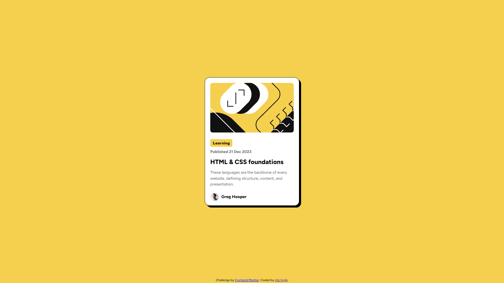

# Frontend Mentor - Blog preview card solution

This is a solution to the [Blog preview card challenge on Frontend Mentor](https://www.frontendmentor.io/challenges/blog-preview-card-ckPaj01IcS). Frontend Mentor challenges help you improve your coding skills by building realistic projects.

## Table of contents

- [Overview](#overview)
  - [The challenge](#the-challenge)
  - [Screenshot](#screenshot)
  - [Links](#links)
- [My process](#my-process)
  - [Built with](#built-with)
- [Author](#author)

## Overview

### The challenge

Users should be able to:

- See hover and focus states for all interactive elements on the page

### Screenshot

### Links

- Solution URL: [Github repo](https://github.com/itzL1m4k/blog-preview-card-main)
- Live Site URL: [Live website](https://blog-preview-card-itzl1m4k.vercel.app/)

## My process

### Built with

- CSS custom properties
- Flexbox

## Author

- Website - [Kamil Popiołek](https://github.com/itzL1m4k)
- Frontend Mentor - [@itzL1m4k](https://www.frontendmentor.io/profile/itzL1m4k)
